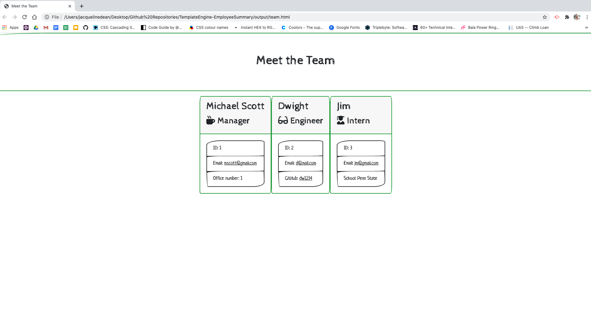

# Template Engine - Employee Summary

## Description 
The Template Engine is a Node CLI that takes in information about employees and generates an HTML webpage that displays summaries for each person. The command line application prompts the user for information about the team manager and then information about the team members. The user can input any number of team members and they may be a mix of engineers and interns. When the user has completed building the team, the application will create an HTML file that displays a nicely formatted team roster based on the information provided by the user. 



### User Story
```
As a manager
I want to generate a webpage that displays my team's basic info
so that I have quick access to emails and GitHub profiles
```

# Table of Contents
[Installation](#installation)

[Usage](#usage)

[Questions](#questions)

# Installation
** In order to use the application, the user will need to have node.js installed and then will need to clone the repository into the command line. 

** Once the repository has been cloned, the user will need to change directories into the repository and run the command "npm install" in order to retrieve the neccessary dependencies. 

# Usage


** Once the application has been installed, the user will run "npm start" in the command line to initialize the prompts.

** After answering each prompt accordingly, the user will will be presented with an HTML file that displays the formatted team roster based on the information provided.

** A video demonstration is also available in the "Assets" folder

# Tests
The application includes 4 tests included in the "test" folder:

** Employee.test.js

** Engineer.test.js

** Intern.test.js

** Manager.test.js

Each test test for criteria to be met in the corresponding files. 

The tests can be run through the command "npm run test".

# Questions
For any questions, please connect with me:

Github username: Jacquelineadean

Github URL: https://github.com/jacquelineadean/

LinkedIn: https://www.linkedin.com/in/jacqueline-dean-968a66150/

Email: Jacquelineadean@gmail.com
